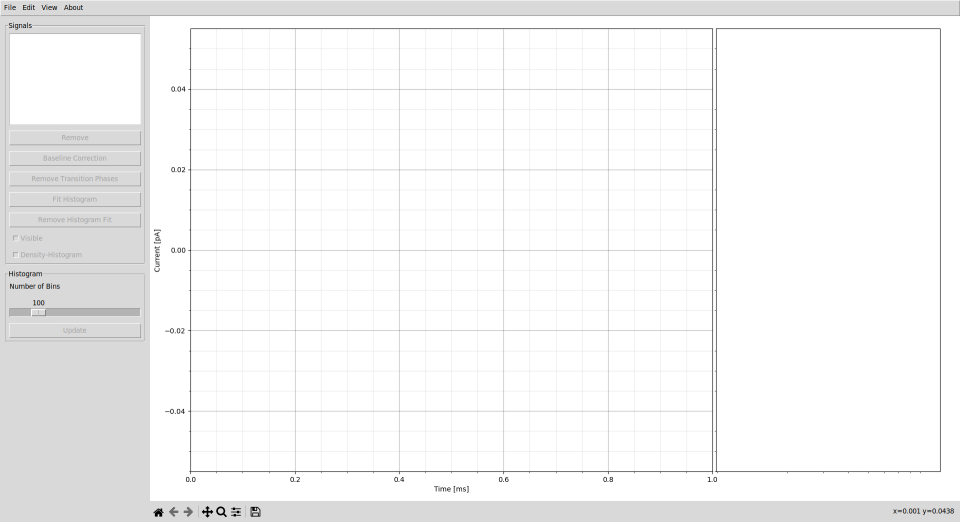
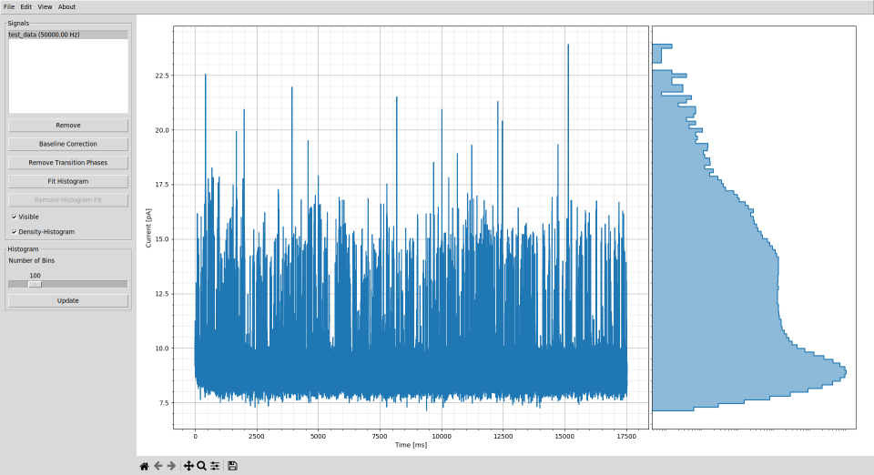
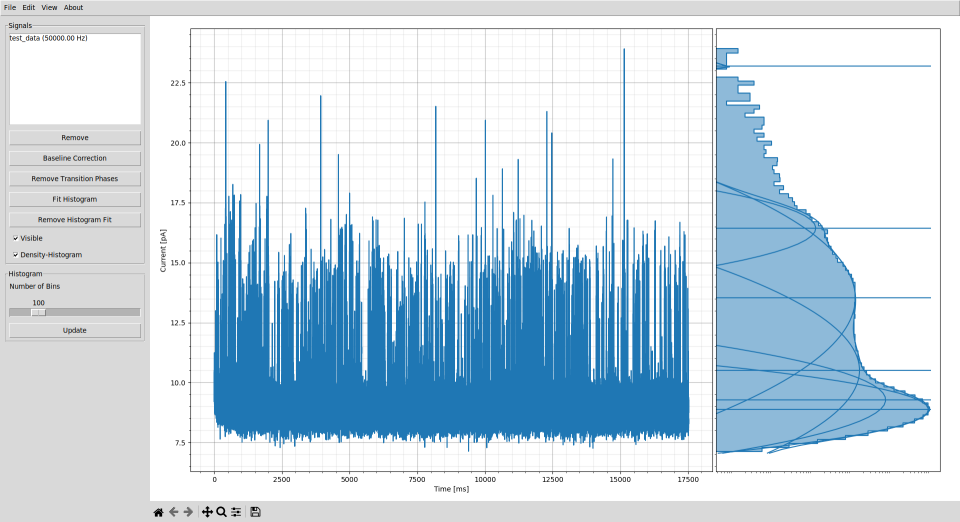

# README

*scana* is an abbreviation for "(s)ingle (c)hannel (ana)lysis" and
is intended to help with the data analysis of single channel measurements.

# Installation
The *scana* software is a tool written in Python and can
therefore be run on various platforms. The starting point
is an installed Python3 interpreter, at least **Python v3.8.9**
or newer is recommended. To install the necessary Python packages,
*pip* must also be installed. The required Python packages and the
corresponding lowest supported version numbers are listed below.
| Module name | Version |
| ----------- | ------- |
| numpy       | 1.24.2  |
| matplotlib  | 3.7.1   |
| scipy       | 1.8.1   |
| pandas      | 1.5.3   |
| xlrd        | 1.2.0   |
| xlwt        | 1.3.0   |

The installation of Python with all the required the packages should 
be done in a few minutes, an installation of *scana* is not necessary.

## Install Python & *pip* on Windows
To install Python on Windows computers please follow the
instructions on the official Python homepage,
https://www.python.org/downloads/windows/ .
The *pip* tool is automatically installed with the Python
installation, if not, please visit
https://www.geeksforgeeks.org/how-to-install-pip-on-windows/ .

Open "Command Prompt" and run

    pyhton --version

to check the installed version.

## Install Python & *pip* on Linux
Python3 is automatically pre-installed on most Linux distributions.
If not, please use the package manager to install Pyhton3 on your
Linux computer.
#### *apt* Package Manager
    sudo apt-get install python3 python3-pip
#### *dnf* Package Manager
    sudo dnf install python3 python3-pip
If you need further help with the Python installation please
visit https://docs.python-guide.org/starting/install3/linux/.

Open your favorite terminal and run

    pyhton --version

to check the installed version.

## Install required Python Modules
To install the required Python packages, open "Command Prompt" on
Windows machines or your favorite terminal on Linux machines.
Navigate to the *scana* directory and run

    pip3 install -r requirements.txt

to install the required packages.

## Remark
Platforms and version numbers with which scana has been successfully
tested can be found in the table below.
|            | **Windows 7** | **Ubuntu 20.04** |
| ---------- | ------------- | ---------------- |
| Python     | 3.8.9         | 3.8.10           |
| numpy      | 1.24.2        | 1.24.4           |
| matplotlib | 3.7.1         | 3.7.3            |
| scipy      | 1.10.1        | 1.10.1           |
| pandas     | 1.5.3         | 2.0.3            |
| xlrd       | 2.0.1         | 1.2.0            |
| xlwt       | 1.3.0         | 1.3.0            |

# Run *scana*

## Run on Windows
Open the file explorere and navigate to the *scana* directory.
To run *scana*, double click on the file *scana.bat*.

## Run on Linux
Open your favorite terminal and navigate to the *scana* directory.
To run *scana*, just type

    bash scana.sh

## Example
* When you start *scana*, a window opens with two empty plot axes.
  
* Clicking on "File -> Open Signal" opens the file dialog. Navigate
  to the "data" directory and open the file "test_data.csv".
  
  The signal itself is plotted on the left axis, while the
  corresponding histogram is shown on the right axis.
* Click on the "Fit Histogram" button and select the number of
  levels (in this case N=6).
  
  Parameters for N=6 Gaussian distributions are now optimized
  so that the histogram is approximated as closely as possible.
  Expected values and the fitted Gaussian distributions are
  plotted in the histogram. In addition, a window opens displaying
  mean value, standard deviation, scaling factor, and relative area
  of all N=6 gaussian distributions. For this example we get:

  | level | mu          | sigma       | rho         | area       |
  | ----- | ----------- | ----------- | ----------- | ---------- |
  | 0     |  8.87532196 | 0.36805637  | 0.82427548  | 0.82427506 |
  | 1     |  9.28038763 | 0.51095489  | 0.09426576  | 0.09426505 |
  | 2     | 10.50761924 | 1.05226472  | 0.04233099  | 0.04230886 |
  | 3     | 13.52930348 | 1.19871217  | 0.03764671  | 0.03764671 |
  | 4     | 16.43523232 | 0.45684961  | 0.00144029  | 0.00144029 |
  | 5     | 23.19680300 | 0.10056731  | 0.00000220  | 0.00000220 |

  The expected runtime for adjusting the curve is in the order of
  a few seconds.
